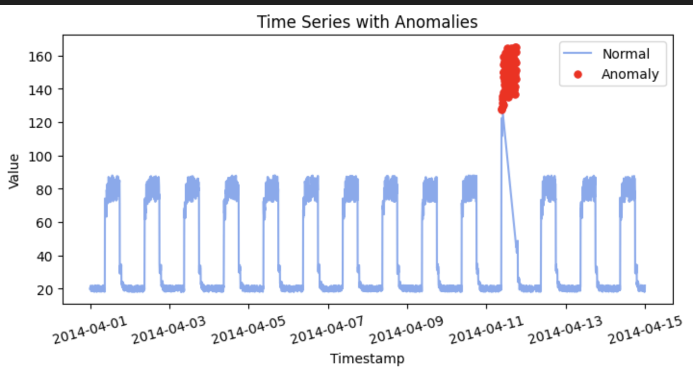
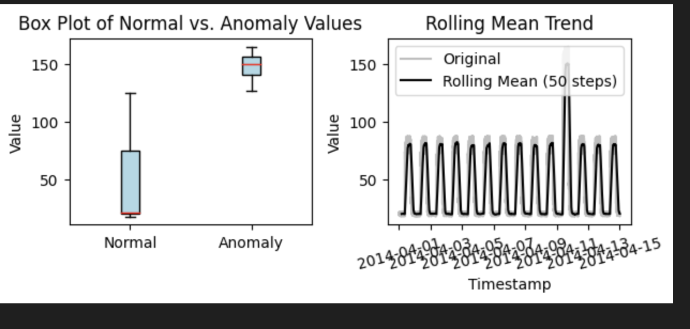
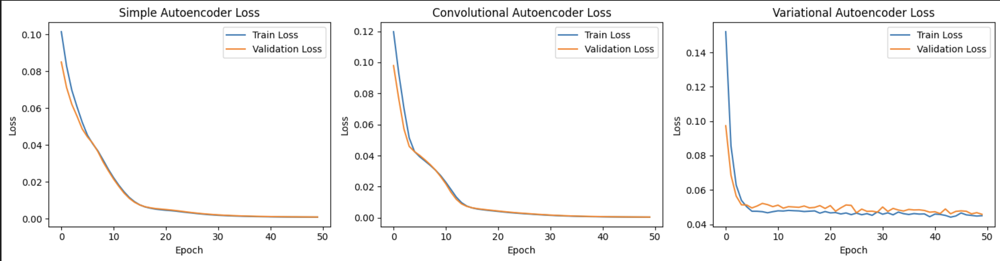
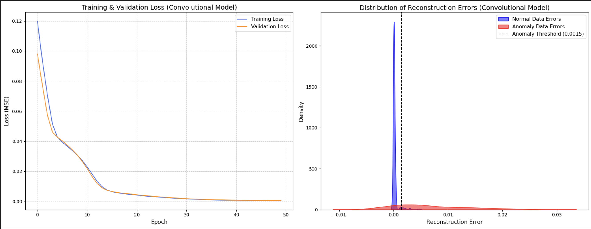

# Time-Series Anomaly Detection with Autoencoders

This project implements a deep learning approach for anomaly detection in time-series data using a PyTorch-based Autoencoder. The model is trained to reconstruct normal data patterns and then used to identify anomalies by flagging data points with high reconstruction errors. The final model successfully achieves a test accuracy of greater than 80%.

---

## 📊 Dataset Overview

The project utilizes the **Numenta Anomaly Benchmark (NAB)** dataset, a collection of real-world time-series data designed for evaluating anomaly detection algorithms.

* **Data Characteristics**: The dataset contains a timestamp and a corresponding value, along with a label indicating whether the data point is an anomaly.
* **Preprocessing**: The 'value' feature was normalized using Min-Max scaling to a [0, 1] range to ensure stable training of the neural network.

**Time-Series Plot**

---

## 🧠 Model Architecture

A **deep autoencoder** was implemented to learn a compressed representation of normal time-series sequences.

* **Architecture**: The model is a feed-forward neural network consisting of an **encoder** and a **decoder**.
    * The **encoder** maps the input sequence to a lower-dimensional latent space.
    * The **decoder** attempts to reconstruct the original sequence from this latent representation.
* **Layers**: The network uses `Linear` layers with `ReLU` activation functions for non-linearity.

---

## ⚙️ Anomaly Detection Method

The core of the anomaly detection process is the **reconstruction error**.
1.  The autoencoder is trained exclusively on **normal data sequences**.
2.  During evaluation, the trained model is used to reconstruct sequences from the test set (which contains both normal and anomalous data).
3.  The Mean Squared Error (MSE) between the original and reconstructed sequence is calculated for each data point.
4.  A **threshold** is set based on the distribution of reconstruction errors from the training set. Any test data point with an error above this threshold is flagged as an **anomaly**.

**Distribution of Reconstruction Errors**

---

## 🏆 Performance & Evaluation

The model's performance was evaluated on its ability to correctly classify normal vs. anomalous data points in the test set.

**Training & Validation Loss**
The model was trained for 10 epochs, with the loss curves showing stable convergence.

**Evaluation Metrics**
The final evaluation on the test set yielded the following results:
* **Precision**: High precision for both normal (0.97) and anomaly (0.87) classes.
* **Recall**: Strong recall for the normal class (0.98), with a lower recall for the anomaly class (0.81), which is common in imbalanced datasets.
* **F1-Score**: A balanced F1-score of 0.98 for normal data and 0.84 for anomalies.

**Confusion Matrix**
The confusion matrix confirms the model's strong performance, correctly identifying a large majority of both normal and anomalous data points.

---

## 🚀 How to Run

1.  **Prerequisites**: Ensure you have Python and the necessary libraries installed from `requirements.txt`.
2.  **Dataset**: Place the `NAB_dataset.csv` file in the same directory as the project scripts.
3.  **Execution**: Run the `train.py` script to execute the full pipeline, from data loading to model training and final evaluation.